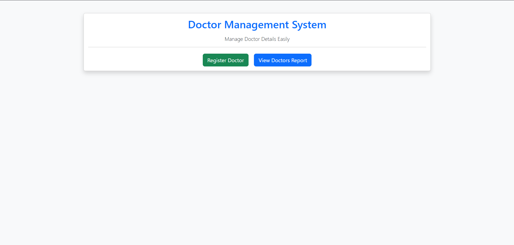
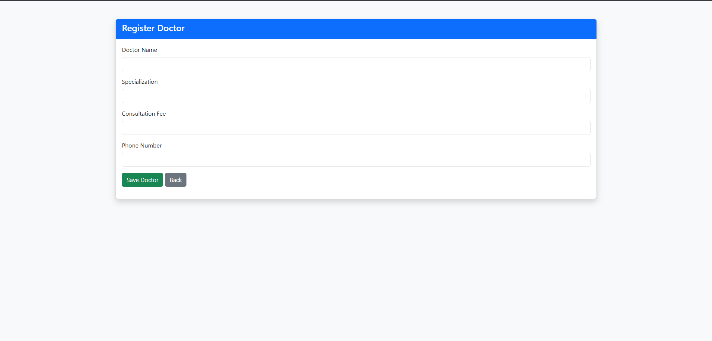
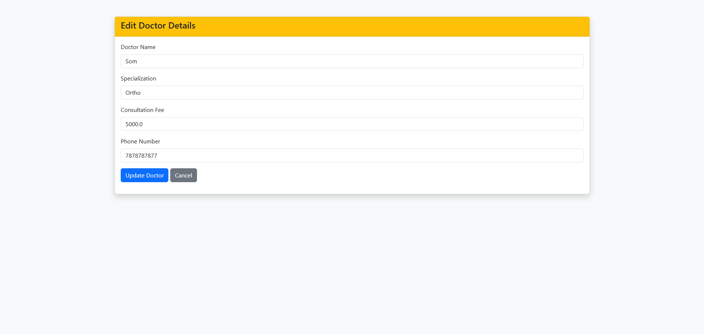
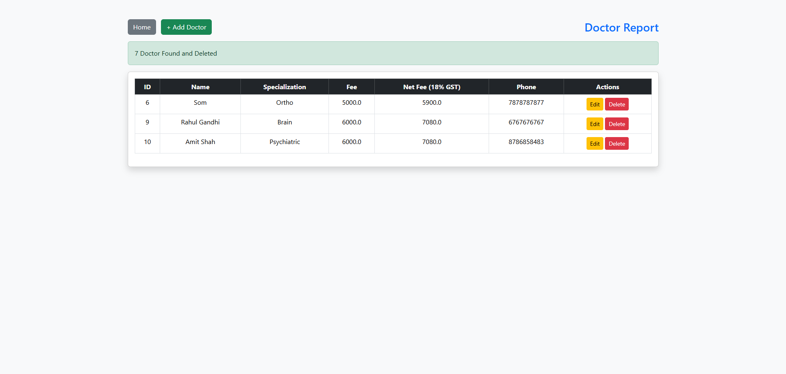

# Doctor Management System (Learning Project)

This is a Spring Boot MVC CRUD application built while learning:

- Spring Boot
- Spring MVC
- Spring Data JPA
- Hibernate
- DTO Pattern
- Layered Architecture

The application manages doctor records with basic Create, Read, Update, and Delete operations.

---

## Application Screenshots

### Home Page


### Doctor Report Page


### Add Doctor Page


### Edit Doctor Page


### Delete Doctor


---

## What I Learned

- MVC Architecture (Controller → Service → Repository → Entity)
- DTO vs Entity difference
- Form Handling using @ModelAttribute
- Validation using @NotBlank and @NotNull
- Exception Handling using Custom Exception
- Redirect vs Forward
- Flash Attributes
- JPA Auditing (createdOn, updatedOn)
- Optimistic Locking using @Version
- Business Logic implementation in Service Layer

---

## Technologies Used

- Java 21
- Spring Boot
- Spring MVC
- Spring Data JPA
- Hibernate
- MySQL / H2
- Lombok

---

## Project Flow
```
Browser
   ↓
Controller
   ↓
Service (Business Logic - GST Calculation)
   ↓
Repository
   ↓
Database
```


---

## Business Logic

GST (18%) is calculated in the Service Layer:

netfee = fee + (fee * 0.18)


---

## Extra Features Practiced

- Audit Fields (createdOn, updatedOn)
- Optimistic Locking (@Version)
- Custom Exception (DoctorNotFoundException)

---

## How to Run

1. Clone the repository

```
git clone https://github.com/your-username/doctor-management-system.git
```

2. Configure database in `application.properties`

3. Run Spring Boot Application

4. Open in browser:
```
http://localhost:8080/
```


---

## Purpose

This project is created purely for learning and practice purposes to understand how Spring Boot MVC applications work internally.

---

## Author

Som Gupta  
GitHub: https://github.com/somguptaa
